# SafeRide System UML Diagrams

This document contains accurate UML diagrams based on the actual SafeRide system architecture and components.

## 1. Agile Scrum Development Lifecycle

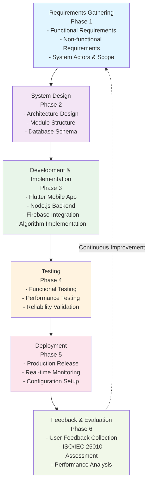

## 2. System Actors & Use Cases

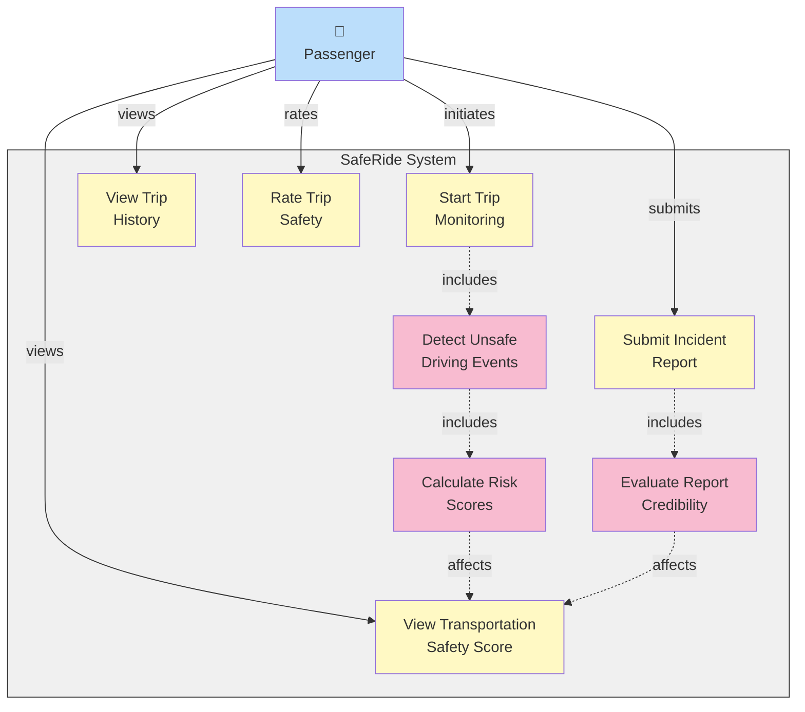

## 3. Component Architecture Diagram

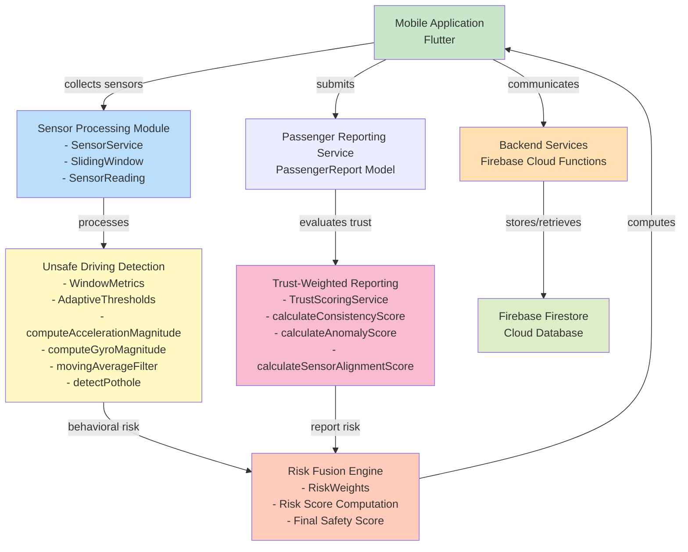

## 4. Class Diagram - Core Models & Services

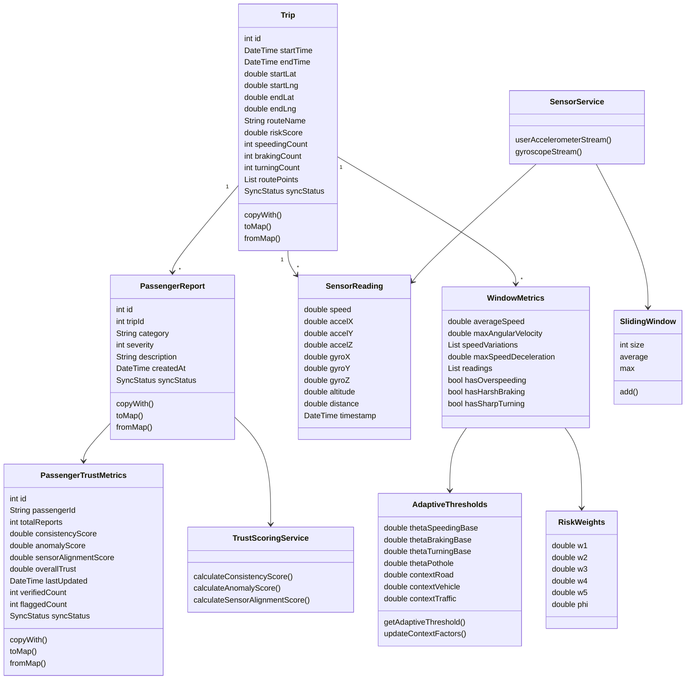

## 5. Trip Monitoring Activity Diagram

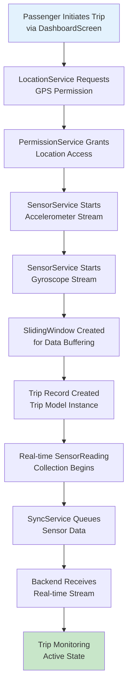

## 6. Incident Report Submission Activity Diagram

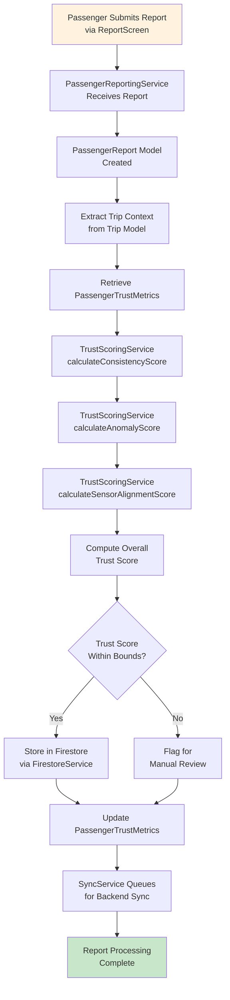

## 7. Risk Score Computation Activity Diagram

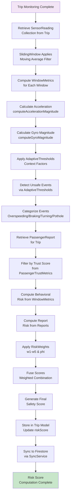

## 8. Trust Scoring Algorithm Workflow

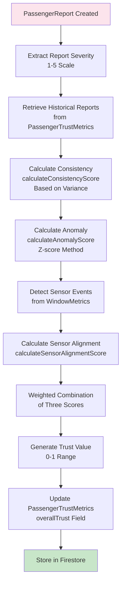

## 9. Deployment Architecture Diagram

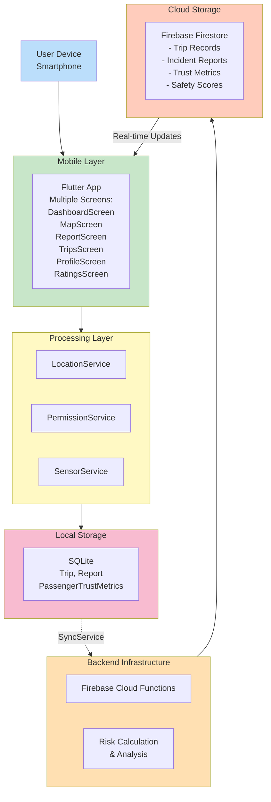

## 10. System Services & Data Flow

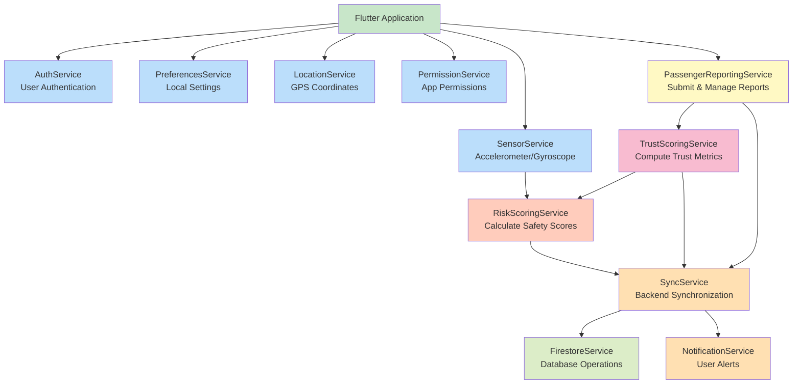

## 11. Feedback & Evaluation Cycle

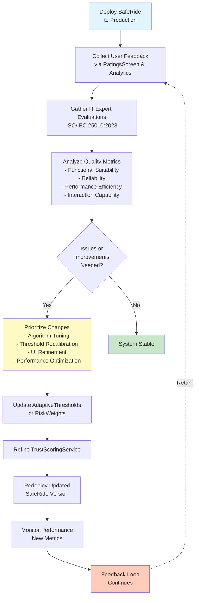

## 12. Data Model Relationships

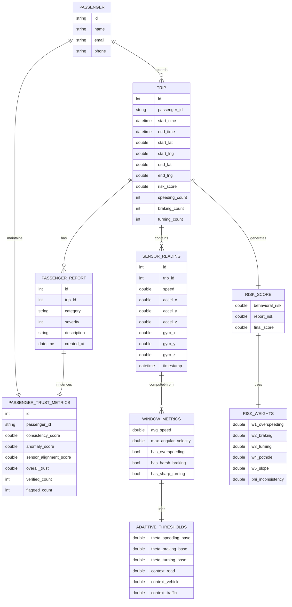

---

## Component Summary

### Core Models
- **Trip**: Represents a transportation journey with sensor data
- **PassengerReport**: Incident report submitted by passenger
- **PassengerTrustMetrics**: Trust assessment of passenger's reports
- **SensorReading**: Individual sensor measurement at timestamp
- **WindowMetrics**: Aggregated metrics for sliding window
- **AdaptiveThresholds**: Dynamic detection thresholds
- **RiskWeights**: Weighted coefficients for risk computation

### Core Services
- **SensorService**: Collects accelerometer and gyroscope data
- **SlidingWindow**: Buffers and processes sensor streams
- **TrustScoringService**: Evaluates report credibility
- **RiskScoringService**: Computes transportation safety scores
- **LocationService**: GPS data collection
- **FirestoreService**: Database operations
- **SyncService**: Backend synchronization
- **PassengerReportingService**: Report management

### UI Screens
- AuthScreen, DashboardScreen, MapScreen, ProfileScreen
- RatingsScreen, ReportScreen, SettingsScreen, TripsScreen, TripDetailScreen

